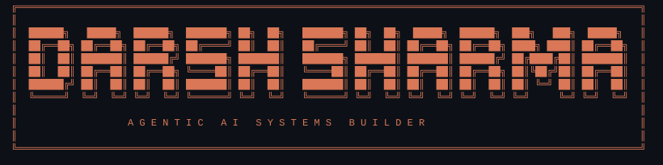

<div align="center">

<div align="center">
  
</div>

### Computer Science student building agentic AI systems, LLM tooling, and intelligent software.

**B.Tech Computer Science & Engineering · BML Munjal University · India**

**Open to Software Engineering & AI/ML internships**

<br />

<a href="https://docs.google.com/document/d/1Uo-VAeQIOYU3MatsH8cjqAGp3eEsutsDrRbPl6k3hN0/edit?usp=sharing">
  
</a>
<a href="https://www.linkedin.com/in/darsh-sharma-7b3169361">
  
</a>
<a href="mailto:darsh1may.0@gmail.com">
  
</a>

<br />


</div>

---

## About

I'm a **Computer Science student focused on AI engineering, software systems, and applied intelligent systems**.

I build across:

`Agentic AI` · `LLM Engineering` · `Software Systems` · `Applied AI` · `IoT`

My work ranges from **multi-agent systems and LLM tooling** to **product-focused software and hardware-integrated applications**.

---

## Currently

> Building AI systems that plan, execute, evaluate, and interact with real software.

**Focus:** `Agentic AI` · `LLM Systems` · `Developer Tools` · `Software Architecture`

---

# Featured Engineering Work

Selected projects focused on AI systems, software architecture, and applied engineering.

## 01 · Token Optimization Engine

### AI-based prompt compression system using a multi-agent architecture.

Token Optimization Engine explores how LLM workflows can become more efficient through **prompt compression, agent coordination, model interaction, routing, and iterative processing**.

**Technical focus**

`Python` · `Multi-Agent Systems` · `OpenRouter` · `tiktoken` · `FastAPI` · `Streamlit`

**Engineering**

Multi-stage prompt analysis, compression, routing, and validation.

**Focus**

Improving LLM workflow efficiency while preserving useful context.

[**View repository →**](https://github.com/darshsharma-bit/token-optimization-engine)

---

## 02 · AGENTIC_OS

### Modular agentic AI system for multi-agent collaboration and autonomous task execution.

AGENTIC_OS explores the architecture required to **register agents, construct task plans, and execute work through modular system components**.

**Technical focus**

`Python` · `Task Planning` · `Agent Orchestration` · `Execution Engine` · `Modular Architecture`

**Engineering**

Agent registration, task planning, orchestration, and modular execution.

**Focus**

Designing agent systems as software architecture rather than a standalone chatbot.

[**View repository →**](https://github.com/darshsharma-bit/AGENTIC_OS)

---

## 03 · SevaKhata

### Bilingual work-and-payment ledger built around a two-sided confirmation model.

SevaKhata explores a shared digital record for **attendance, work records, advances, payments, disputes, and month-end settlement**.

**Technical focus**

`JavaScript` · `HTML` · `CSS` · `State-driven UX` · `Accessibility` · `Responsive Design`

**Engineering**

State-driven workflows, shared confirmation, responsive UI, and accessibility.

**Focus**

Turning a real-world workflow into a structured digital system.

[**View repository →**](https://github.com/darshsharma-bit/SevaKhata)


---

## 04 · RideSafePlus

### Intelligent road anomaly and pothole detection system.

RideSafePlus focuses on detecting **road anomalies and potholes** to support safer mobility through automated road-condition analysis.

**Technical focus**

`C++` · `Road Anomaly Detection` · `IoT` · `Embedded Systems`

**Engineering**

Road-condition sensing, anomaly detection, and embedded data processing.

**Focus**

Applying software and sensing to real-world mobility safety.

[**View repository →**](https://github.com/darshsharma-bit/RideSafePlus)

---

## 05 · LynX-by-VOX

### Maritime navigation and safety system integrating mobile software with embedded hardware.

LynX-by-VOX combines **Flutter, ESP32, GPS, and connected sensing** to support navigation and safety workflows for maritime environments.

**Technical focus**

`Flutter` · `Dart` · `ESP32` · `GPS` · `IoT`

**Engineering**

Flutter application + ESP32 + GPS + connected sensing.

**Focus**

End-to-end mobile, embedded, and connectivity engineering.

[**View repository →**](https://github.com/darshsharma-bit/LynX-by-VOX)

---

# Technical Stack

### Languages


### AI / LLM


### Frontend


### Embedded / IoT


### Tools


---

# Engineering Approach

```text
PROBLEM
   │
   ▼
UNDERSTAND
   │
   ├── requirements
   ├── constraints
   └── failure cases
   │
   ▼
DESIGN
   │
   ├── architecture
   ├── interfaces
   └── execution flow
   │
   ▼
BUILD
   │
   ├── implementation
   ├── integration
   └── validation
   │
   ▼
MEASURE
   │
   ├── correctness
   ├── performance
   └── usability
   │
   ▼
ITERATE
```

I aim to move projects from **idea → architecture → implementation → verification**, rather than stopping at a prototype.

---

# GitHub Activity

<div align="center">

<a href="https://github.com/darshsharma-bit">
  
</a>

<a href="https://github.com/darshsharma-bit">
  
</a>

</div>

---

## Contribution Activity

<div align="center">

<a href="https://github.com/darshsharma-bit">
  
</a>

</div>

---

# Contact

Interested in **AI systems, developer tools, intelligent applications, and software infrastructure**.

<div align="center">

<a href="<!-- TODO: add resume URL -->">
  
</a>

<a href="https://www.linkedin.com/in/darsh-sharma-7b3169361">
  
</a>

<a href="mailto:darsh1may.0@gmail.com">
  
</a>

<a href="https://github.com/darshsharma-bit">
  
</a>

</div>

---

<div align="center">

### DARSH SHARMA

<sub>Building intelligent systems from architecture to execution.</sub>
